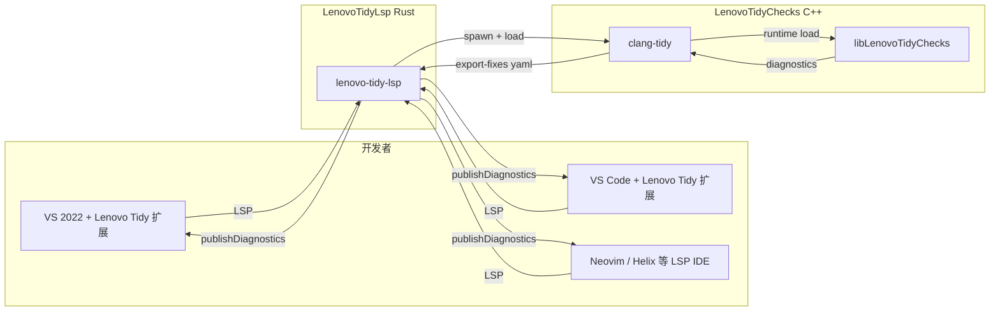

# 架构

## 总体视图（v0.2）



## 分层职责

| 层 | 项目 | 语言 | 职责 |
|---|---|---|---|
| IDE 扩展 | LenovoTidyVscode / LenovoTidyVs2022 | TS / C# | 注册 LSP 客户端，启动 lenovo-tidy-lsp |
| LSP 服务 | LenovoTidyLsp | Rust | 协议解析、子进程驱动、YAML 解析 |
| 规则引擎 | LenovoTidyChecks | C++ | 15 条 `lenovo-*` 自定义检查 |
| 工具链 | clang-tidy + LLVM 18 | — | 通用 AST、ClangTidyCheck 基类 |

## 跨语言数据流

1. IDE 保存 `foo.cpp`
2. 扩展通过 LSP 发送 `textDocument/didSave`
3. LSP 服务器 spawn `clang-tidy -load=plugin.so --export-fixes=tmp.yaml foo.cpp`
4. clang-tidy 加载插件，执行 15 条 `lenovo-*` 规则
5. 诊断写入 `tmp.yaml`
6. LSP 解析 YAML，把 file offset 转为 line/column
7. 通过 `publishDiagnostics` 推回 IDE
8. IDE 在 Problems / Error List 面板显示

## 规则 ID 对齐策略

```
C# 侧 (AnalyzerRules.md)            C++ 侧 (Clang-Tidy)
SEC001 Sensitive info     ⟺   lenovo-sec001-hardcoded-sensitive
SEC002 Path traversal     ⟺   lenovo-sec002-path-traversal
... (共 15 条对齐)
DLL002 P/Invoke           ⟶   N/A (语言无此特性)
SEC009 Reflection         ⟶   N/A (语言无此特性)
```

## 版本与发布

| 项目 | 版本 |
|---|---|
| LenovoTidyChecks | 0.2.0 |
| LenovoTidyLsp | 0.1.0 |
| LenovoTidyVscode | 0.1.0 |
| LenovoTidyVs2022 | 0.1.0 |

发布时四个产物**统一打 tag**，CI 自动构建产物：

- `LenovoTidyChecks-<os>.tar.gz`
- `lenovo-tidy-lsp-<os>` 二进制
- `lenovo-tidy-vscode-x.y.z.vsix`
- `LenovoTidy-x.y.z.vsix`（VS 2022）
