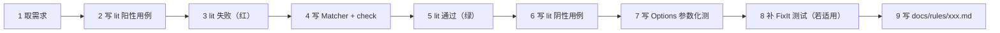

# TDD 工作流

> **硬性约束**：所有新规则必须 **先有失败的 lit 测试，再有实现**。PR 提交顺序如下所示。

## 一、9 步标准流程



## 二、一条示例：从 0 到 SEC002

### Step 1 ─ 提取需求

从 [`AnalyzerRules.md`](../../AnalyzerRules.md#sec002---path-traversal-risk) 中 SEC002 的 ❌ / ✅ 示例。

### Step 2 ─ 阳性用例

`tests/checkers/sec002-path-traversal/unsafe-concat.cpp`：

```cpp
// RUN: %check_clang_tidy %s lenovo-sec002-path-traversal %t
#include <string>
std::string Read(const std::string& user) {
  std::string path = "/base/" + user;
  // CHECK-MESSAGES: :[[@LINE-1]]:22: warning: concatenated path may allow directory traversal [lenovo-sec002-path-traversal]
  return path;
}
```

### Step 3 ─ 期望失败

```bash
ctest --preset linux-release -R lenovo-tidy-lit -V
# FAIL: 规则尚未实现
```

### Step 4 ─ 最小实现

`security/PathTraversalCheck.cpp` 里只写到让这一条测试通过。

### Step 5 ─ 期望通过

```bash
ctest --preset linux-release -R lenovo-tidy-lit -V
# PASS
```

### Step 6 ─ 阴性用例

`tests/checkers/sec002-path-traversal/valid.cpp`，涵盖 `Path.GetFullPath` 类等价写法。

### Step 7 ─ Options

`sec002-path-traversal-options.cpp` 显式传 `SanitizerFunctions: "MySanitize"` 等。

### Step 8 ─ FixIt

若规则能给出一键修复（本例：建议包裹 `std::filesystem::weakly_canonical`），在 `check()` 里构造 `FixItHint`，并用 `CHECK-FIXES:` 校验。

### Step 9 ─ 文档

`docs/rules/sec002.md`，参照现有 3 条规则的模板。

## 三、提交顺序建议

PR 中 commit 的顺序建议：

1. `test(sec002): add failing lit cases`
2. `feat(sec002): implement path-traversal check`
3. `test(sec002): add valid-case guards and options`
4. `docs(sec002): add rule reference page`

让 reviewer 一眼看出"先红后绿"。

## 四、什么时候可以不写 lit 测试

仅限以下场景：

- 纯内部重构（不改规则行为）
- 修复一个已有 lit 测试的 FIXME
- 工具层函数改动（用 GoogleTest 单元测替代）

其他情况一律 **不得** 绕过 lit。
