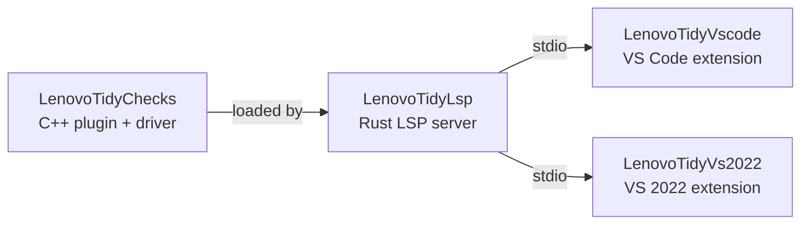
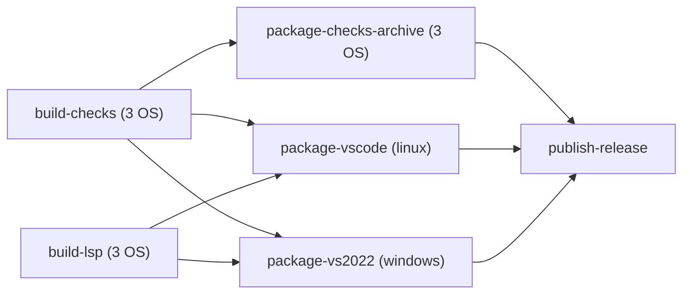

# Lenovo Tidy

[](https://github.com/jiaGuoWr/LenovoCodeDRJ_CLang/actions/workflows/build-test.yml)
[](https://github.com/jiaGuoWr/LenovoCodeDRJ_CLang/actions/workflows/lsp-build.yml)
[](https://github.com/jiaGuoWr/LenovoCodeDRJ_CLang/actions/workflows/extension-build.yml)
[](https://github.com/jiaGuoWr/LenovoCodeDRJ_CLang/actions/workflows/docs-deploy.yml)

Lenovo DRJ custom Clang-Tidy rules for C/C++, packaged as a Clang-Tidy
plugin, a self-contained driver, an LSP server, and IDE extensions for VS
Code and Visual Studio 2022. Enforces 15 `lenovo-*` rules
(security / naming / localization) — see
[`AnalyzerRules.md`](AnalyzerRules.md) for the full reference.

## Repository layout

```text
LenovoTidyChecks/        C++ Clang-Tidy plugin + lenovo-clang-tidy.exe driver
                          (statically links LLVM/Clang on Windows so the rules
                           still load without external plugin support)
LenovoTidyLsp/           Rust tower-lsp server that shells out to clang-tidy
                          and parses --export-fixes YAML
LenovoTidyVs2022/        C# / .NET 4.7.2 ILanguageClient bridge -> .vsix
LenovoTidyVscode/        TypeScript LanguageClient bridge -> .vsix
windows-build/           Reproducible PowerShell build pipeline + diagnostic
                          and verification scripts
.github/workflows/       GitHub Actions CI/CD (build / test / package / release)
```



## Quick start

End users only need the pre-built artefacts. See
[`INSTALL_WINDOWS.md`](INSTALL_WINDOWS.md) for the full guide.

```powershell
# VS Code (Windows / Linux / macOS)
code --install-extension lenovo-tidy-vscode.vsix

# Visual Studio 2022 (double-click and follow the wizard)
LenovoTidy.vsix
```

After install, open a C/C++ project that has (or can produce)
`compile_commands.json` and save any `.cpp`/`.h` file. Diagnostics appear
in **Problems** (VS Code) or **Error List** (VS 2022) prefixed with the
rule id, e.g. `lenovo-sec001-hardcoded-sensitive`.

## Building from source

Three independent build pipelines, all reproducible:

| Component        | Build                                                                 | OS                  |
| ---------------- | --------------------------------------------------------------------- | ------------------- |
| LenovoTidyChecks | `cmake -S . -B build -G Ninja -DLENOVO_TIDY_BUILD_TESTS=ON && cmake --build build -j` | Linux / macOS / Windows |
| LenovoTidyLsp    | `cargo build --release` in `LenovoTidyLsp/`                            | Linux / macOS / Windows |
| Both VSIXes      | `windows-build\build-vscode.ps1` + `windows-build\build-vs2022.ps1`    | Windows             |

For a one-shot Windows build that bootstraps every dependency under
`D:\dev-tools\` (LLVM 18, VS Build Tools 2022, Rust, Python, CMake), see
the maintainer section of [`INSTALL_WINDOWS.md`](INSTALL_WINDOWS.md).

## CI / CD

Five GitHub Actions workflows live under
[`.github/workflows/`](.github/workflows/):

| Workflow                | Trigger                              | Job                                                                        |
| ----------------------- | ------------------------------------ | -------------------------------------------------------------------------- |
| `build-test.yml`        | PR + push to `main` (paths-filtered) | Multi-OS build of LenovoTidyChecks, ctest, lenovo-clang-tidy smoke test    |
| `lsp-build.yml`         | PR + push to `main` (paths-filtered) | Multi-OS Rust build + cargo test, uploads platform LSP binaries            |
| `extension-build.yml`   | PR + push to `main` (paths-filtered) | VS Code `tsc` + VS 2022 `dotnet build` sanity, strong-name version assert  |
| `docs-deploy.yml`       | push to `main` (LenovoTidyChecks/docs/**) | mkdocs build + deploy to GitHub Pages                                  |
| `release.yml`           | tag push `v*`                        | Build everything fresh + assemble both .vsix + tarballs + GitHub Release   |

The release pipeline shape:



### Pre-release manual gate

CI cannot run the VS 2022 end-to-end activation test (hosted runners
have no `devenv.exe`). Maintainers MUST run
`windows-build\verify.ps1` locally on a machine with VS 2022 installed
before pushing a `v*` tag. See the corresponding section of
[`INSTALL_WINDOWS.md`](INSTALL_WINDOWS.md).

## License

Apache-2.0. See [`LenovoTidyChecks/LICENSE`](LenovoTidyChecks/LICENSE) and
[`LenovoTidyVs2022/LICENSE.txt`](LenovoTidyVs2022/LICENSE.txt).
